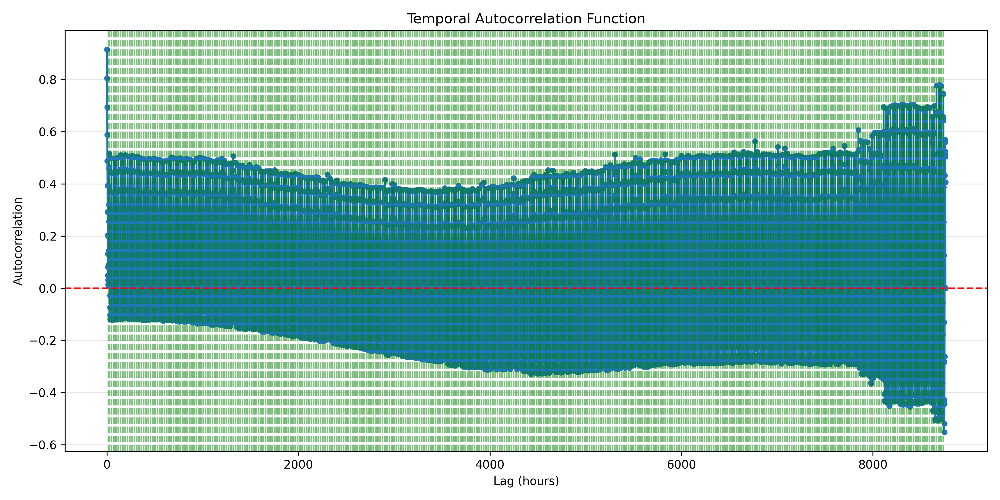

# Spatio-Temporal Regression by Data Transformation

This project implements a spatio-temporal regression framework to predict high-resolution climate data from low-resolution inputs. The core idea is to transform the data using spatio-temporal sliding windows, optimize the temporal context, and then apply a regression model. The approach is fully data-driven, with automated selection of the most informative temporal lags for each spatial location.

## Contents

- [Core Concept and Methodology](#core-concept-and-methodology)
- [Project Structure](#project-structure)
- [File Descriptions](#file-descriptions)
- [Key Hyperparameters and Their Impact](#key-hyperparameters-and-their-impact)
- [Workflow](#workflow)
- [Results and Visualization](#results-and-visualization)
  - [Temporal Window Optimization](#temporal-window-optimization)
  - [Visualization](#visualization)
- [Quickstart](#quickstart)

## Core Concept and Methodology

- **Spatio-Temporal Data Transformation:**
  - For each target high-resolution pixel at time `t`, the model uses:
    - **Spatial context:** A small window (e.g., 3x3) from the low-res data around the location
    - **Temporal context:** Similar windows from several past time steps (e.g., t-1h, t-2h, t-24h)
    - **Bias information:** A window from a static bias image
- **Temporal Window Optimization:**
  - Analyzes the temporal correlation structure of the data
  - Uses forward-backward selection and frequency analysis to find the most informative lags
  - Produces a common temporal window for efficient and effective regression

## Project Structure

The repository is organized as follows:

```
.
├── cfg.yml
├── data_compression.py
├── data_transform.py
├── temporal_window_optimizer.py
├── analyze_lag_correlations.py
├── idea.txt
├── requirements.txt
├── SpatioTemporalData.py
├── str.py
├── data/
│   ├── bias_pattern.png
│   ├── bias.nc
│   ├── bias.npy
│   ├── correlation_analysis.npz
│   ├── high resolution_temporal_avg.png
│   ├── linear_training_history.npy
│   ├── low resolution_temporal_avg.png
│   ├── model_predictions_avg.png
│   ├── temporal_autocorrelation.png
│   ├── temporal_dynamics.png
│   ├── temporal_window_optimization.txt
│   ├── high_res_data/
│   ├── low_res_data/
│   ├── plots/
│   │   ├── autocorrelation.png
│   │   └── lag_correlations.png
│   ├── test_X/
│   ├── test_y/
│   ├── train_X/
│   └── train_y/
└── __pycache__/
```

## File Descriptions

1. **`cfg.yml`**: Central configuration file for all parameters (data generation, regression, neural network, visualization, etc.)
2. **`SpatioTemporalData.py`**: Generates synthetic spatio-temporal data with realistic spatial and temporal patterns, including momentum, weather events, and weekly cycles.
3. **`analyze_lag_correlations.py`**: Analyzes and visualizes temporal correlation patterns:
    - Computes correlation between current and lagged values
    - Plots lag correlation bar chart and autocorrelation function
    - Identifies most informative lags and periodicity
4. **`temporal_window_optimizer.py`**: Optimizes the temporal window for regression:
    - Per-location forward-backward lag selection
    - Frequency-based aggregation to find a common window
    - Updates config and saves detailed report
5. **`data_transform.py`**: Transforms raw data into regression-ready features and targets using the optimized temporal and spatial windows.
6. **`str.py`**: Trains and evaluates the regression model (linear, SVM, RF, or neural network). Computes metrics and saves predictions.
7. **`data_compression.py`**: Utilities for chunking and loading large datasets efficiently.
8. **`idea.txt`**: Project design notes and algorithm sketches.
9. **`data/`**: All generated and processed data, including chunked arrays, plots, and results.

## Key Hyperparameters and Their Impact

The `cfg.yml` file controls all aspects of data generation, transformation, and model training. The following hyperparameters are especially impactful:

### Data Generation
- **`image_size`**: Controls the spatial resolution of the synthetic data. Larger sizes increase computational cost but allow for more spatial detail.
- **`hours`**: Number of time steps (hours) to simulate. More hours provide richer temporal patterns but increase data size.
- **`center_temp_range` / `outer_temp_range`**: Set the temperature contrast between urban centers and outer regions, affecting the strength of spatial patterns.
- **`falloff_rate`**: Controls how quickly temperature drops off from urban centers, shaping the spatial gradient.
- **`daily_peak_hour` / `daily_low_hour`**: Set the timing of daily temperature cycles, influencing diurnal patterns.

### Regression & Data Transformation
- **`spatial_window`**: Size of the spatial context window (e.g., 3x3). Larger windows provide more context but increase feature dimensionality and risk overfitting.
- **`temporal_window`**: List of time lags (in hours) to use as temporal context. The choice of lags is critical for capturing relevant temporal dependencies. Optimized automatically in this project.
- **`stride`**: Controls the step size for the sliding window. Smaller strides increase data density but also computational load.
- **`train_size`**: Fraction of data used for training. Affects the amount of data available for model fitting versus evaluation.
- **`batch_size`**: Number of samples per training batch. Impacts memory usage and training speed.
- **`loss_type`**: Loss function for regression (e.g., `mse`). Determines the optimization objective.
- **`regressor_type`**: Choice of regression model (`linear`, `svm`, `rf`, `neural_network`). Strongly affects model capacity and interpretability.

### Neural Network (if used)
- **`hidden_layers`**: List specifying the size of each hidden layer. More/larger layers increase model capacity but risk overfitting.
- **`dropout_rate`**: Fraction of neurons randomly dropped during training. Helps prevent overfitting.
- **`learning_rate`**: Step size for weight updates. Too high can cause instability; too low can slow convergence.
- **`epochs`**: Maximum number of training epochs. More epochs allow for more learning but risk overfitting if not controlled by early stopping.
- **`early_stopping_patience`**: Number of epochs to wait for improvement before stopping. Prevents overfitting and wasted computation.

### Data Quantization
- **`quantization.enabled`**: If true, reduces data precision to save space and speed up computation. May slightly reduce accuracy.
- **`quantization.precision`**: Controls the floating-point precision (e.g., `fp8`). Lower precision saves space but can introduce quantization error.

### Visualization
- **`colormap`, `dpi`, `figure_size`**: Affect the appearance and clarity of generated plots.

**Summary:**
- The most critical hyperparameters for model performance are the spatial and temporal window sizes, the choice of regressor, and the neural network architecture (if used).
- Data generation parameters control the realism and complexity of the synthetic dataset, which in turn affects the difficulty of the regression task.
- Quantization and batch size are important for scaling to large datasets.

## Workflow

1. **Configure** parameters in `cfg.yml`.
2. **Generate** synthetic data: `python SpatioTemporalData.py`
3. **Analyze** temporal correlation: `python analyze_lag_correlations.py`
4. **Optimize** temporal window: `python temporal_window_optimizer.py`
5. **Transform** data for regression: `python data_transform.py`
6. **Train and evaluate** model: `python str.py`

Alternatively, run all steps with:
```bash
./orchestrator.sh
```

## Results and Visualization

### Temporal Window Optimization

- Most informative lags: `[-24, -23, -3, -2, -1]`
- Recent lags (`-1h, -2h, -3h`) capture short-term effects; day-before lags (`-24h, -23h`) capture daily cycles
- Selection frequency:
  - `-1h`: 100% of locations
  - `-2h`: 66.9%
  - `-3h`: 57.2%
  - `-24h`: 42.8%
  - `-23h`: 33.1%

### Visualization


*Average correlation between current time and each lag across all spatial locations. Higher bars indicate lags with stronger predictive power. The red dashed line marks a significance threshold for correlation.*


*Autocorrelation function showing how similar the time series is to itself at different lags (in hours). Peaks in the blue curve indicate repeating patterns or cycles. Green dotted vertical lines are placed every 24 hours to highlight daily cycles. The red dashed horizontal line at y=0 is a reference for zero correlation. Strong peaks at multiples of 24 hours confirm daily periodicity.*

## Quickstart

After installing dependencies (`pip install -r requirements.txt`):
```bash
python SpatioTemporalData.py
python analyze_lag_correlations.py
python temporal_window_optimizer.py
python data_transform.py
python str.py
```
Or run all steps:
```bash
./orchestrator.sh
```

---

This README has been reorganized for clarity and logical flow. See each script for further details and usage options.
