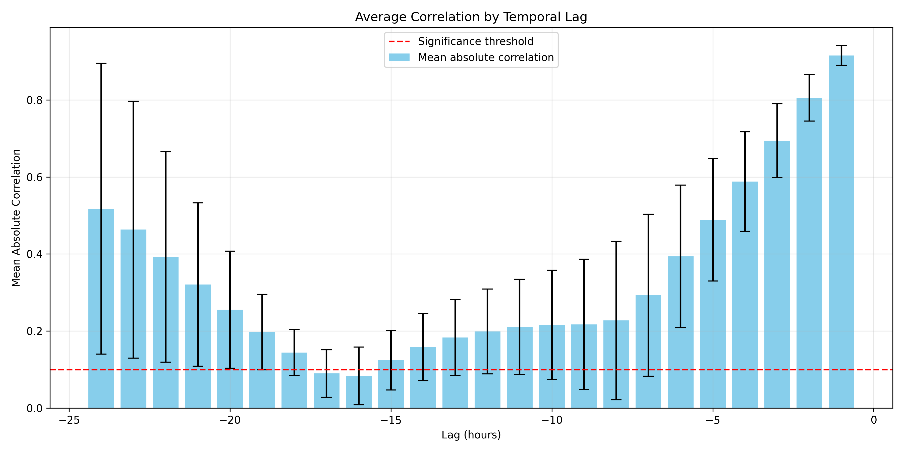

# Spatio-Temporal Regression by Data Transformation

This project implements a spatio-temporal### 4. `analyze_lag_correlations.py`
A utility for analyzing and visualizing temporal correlation patterns in the data:
- Calculates correlation between the current time and each lag for all spatial locations
- Computes autocorrelation function to reveal cyclical patterns
- Generates visualizations of correlation structure including:
  - Lag correlation bar chart showing the strength of correlation for each lag
  - Autocorrelation function plot to identify cyclical patterns in the data
- Samples locations to balance computational efficiency with statistical robustness
- Saves detailed correlation statistics for further analysis
- Identifies most correlated lags to guide temporal window selection
- Helps in understanding the temporal dependencies in the data beyond simple intuition

### 5. `data_compression.py`ion model to predict high-resolution climate data from low-resolution inputs. The core idea is to transform the data using spatio-temporal sliding windows and then apply a regression model.

## Project Structure

```
.
├── cfg.yml
├── data_compression.py
├── data_transform.py
├── temporal_window_optimizer.py
├── analyze_lag_correlations.py
├── idea.txt
├── requirements.txt
├── SpatioTemporalData.py
├── str.py
├── data/
│   ├── bias_pattern.png
│   ├── bias.nc
│   ├── bias.npy
│   ├── correlation_analysis.npz
│   ├── high resolution_temporal_avg.png
│   ├── linear_training_history.npy
│   ├── low resolution_temporal_avg.png
│   ├── model_predictions_avg.png
│   ├── temporal_autocorrelation.png
│   ├── temporal_dynamics.png
│   ├── temporal_window_optimization.txt
│   ├── high_res_data/
│   ├── low_res_data/
│   ├── plots/
│   │   ├── autocorrelation.png
│   │   └── lag_correlations.png
│   ├── test_X/
│   ├── test_y/
│   ├── train_X/
│   └── train_y/
└── __pycache__/
```

## Files

### 1. `cfg.yml`
This YAML file stores all the configuration parameters for the project. It's divided into sections:
- **`data_generation`**: Parameters for generating synthetic spatio-temporal data, including image size, duration (hours), urban heat island effect parameters (falloff rate, temperature ranges), and daily temperature cycle parameters.
- **`data`**: Specifies the directory for storing data and filenames for various datasets (low resolution, high resolution, bias, transformed training/testing sets).
- **`regression`**: Parameters for the spatio-temporal regression model, such as the spatial window size, temporal window (hours to look back), stride for the sliding window, train-test split ratio, choice of regressor (linear, SVM, Random Forest, Neural Network), and loss function.
- **`neural_network`**: Specific parameters if a neural network regressor is chosen, including hidden layer architecture, dropout rate, learning rate, batch size, epochs, and early stopping patience.
- **`visualization`**: Parameters for generating plots, like figure size, colormap, and DPI.

### 2. `requirements.txt`
Lists all the Python dependencies required to run the project. These include:
- `numpy`
- `scikit-learn`
- `scikit-image`
- `matplotlib`
- `torch` (for neural network models)
- `typing-extensions`
- `PyYAML` (for reading the `cfg.yml` file)
- `tqdm` (for progress bars)

You can install these using:
```bash
pip install -r requirements.txt
```

### 3. `SpatioTemporalData.py`
This script is responsible for generating synthetic spatio-temporal data.
- **`SpatioTemporalDataGenerator` class**:
    - Initializes with parameters from `cfg.yml`.
    - `_generate_base_spatial_pattern()`: Creates a complex spatial pattern representing an urban environment with multiple heat centers, sub-centers, cool spots (water bodies, parks), and temperature anomalies. It incorporates fine-scale texture and noise for realism.
    - `_apply_resolution()`: Simulates low-resolution data by applying smoothing and degradation (e.g., rectangular artifacts) to the high-resolution pattern.
    - `_apply_temporal_patterns()`: Modulates the spatial pattern over time using daily and seasonal temperature cycles. Enhanced to include multiple advanced temporal effects:
        - **Momentum/inertia effects**: Each timestep is influenced by previous hours with diminishing influence
            - 80% from current pattern + 20% from 1 hour ago
            - 90% from above + 10% from 6 hours ago
            - 95% from above + 5% from 12 hours ago
        - **Weather events**: Random localized or widespread temperature anomalies with realistic properties:
            - Duration: 6-24 hours (randomly determined)
            - Intensity: -0.3 to +0.3 temperature deviation
            - Spatial coverage: Either localized or widespread
            - Lifecycle: Gradual onset and decay
        - **Weekly patterns**: Small periodic variations on a 7-day cycle
            - Models human activity patterns (e.g., weekday/weekend differences)
            - Applied with small amplitude to avoid dominating other patterns
    - `generate()`: Produces either high-resolution or low-resolution spatio-temporal data for a specified duration.
    - `generate_bias()`: Creates a static bias pattern, representing consistent spatial differences (e.g., due to sensor characteristics or fixed geographical features).
    - `visualize_temporal_dynamics()`: Analyzes and visualizes the temporal patterns at multiple locations to verify complex temporal dependencies.
    - `sanity_check()`: Visualizes a sample of the generated data for quick verification.
- The `main()` function in this script orchestrates the generation of low-resolution data, high-resolution data, and the bias pattern, saving them into the `data/` directory (chunked for large datasets). It also saves a visualization of the bias pattern.

### 4. `temporal_window_optimizer.py`
This script optimizes the temporal window (which hours in the past are most informative) for the regression model:
- **`calc_partial_correlation()`**: Calculates the correlation between a feature and target while controlling for other variables.
- **`calc_objective_score()`**: Calculates a comprehensive score for a given set of temporal lags:
    - Combines mean correlation and maximum correlation (0.7/0.3 weighting)
    - Applies diminishing returns for additional lags to encourage parsimony
    - Balances predictive power with model complexity
- **`optimize_temporal_window()`**:
    - Analyzes each spatial location independently for a personalized approach
    - Uses a robust two-stage selection process:
        1. Forward-greedy selection to add lags that improve the score
        2. Backward pruning to remove less informative lags
    - Tracks the frequency of selection for each lag across all locations
    - Selects lags that appear in at least 15% of locations
    - Identifies a common temporal window based on lag selection frequency
    - Enforces minimum and maximum constraints on the number of lags
    - Updates the configuration with the optimized window
    - Creates detailed optimization report with selection frequencies
- The optimization process results in a more efficient and effective temporal window for the regression model, focusing on the most informative past time points.

### 5. `analyze_lag_correlations.py`
A utility for analyzing and visualizing temporal correlation patterns in the data:
- Calculates correlation between the current time and each lag for all spatial locations
- Computes autocorrelation function to reveal cyclical patterns
- Generates visualizations of correlation structure
- Helps in understanding the temporal dependencies in the data

### 6. `data_compression.py`
This utility script provides functions for handling large datasets by splitting them into smaller, more manageable chunks.
- **`chunk_dataset()`**: Takes a large NumPy array and splits it into multiple smaller `.npy` files (chunks) based on a specified chunk size in megabytes. It saves these chunks into a specified output directory.
- **`load_chunked_dataset()`**: Loads data that has been previously chunked by `chunk_dataset()`. It reads all chunk files from a directory, concatenates them, and returns a single NumPy array.

### 5. `data_transform.py`
This script performs the core data transformation process, preparing the raw spatio-temporal data for the regression model.
- **`load_config()`**: Loads configuration from `cfg.yml`.
- **`pad_images()`**: Adds zero padding to images.
- **`extract_patches()`**: Efficiently extracts patches from an image using `stride_tricks.sliding_window_view`.
- **`transform_data()`**:
    1. Loads the raw low-resolution, high-resolution, and bias datasets (using `load_chunked_dataset` from `data_compression.py`).
    2. Performs a sequential train-test split on the data.
    3. For both training and testing sets:
        - Iterates through time steps (starting from an index that allows for the full temporal window).
        - For each time step `t`:
            - Collects temporal slices from the low-resolution data based on the `temporal_window` specified in `cfg.yml`. These slices are padded.
            - Appends the (padded) static bias image to these temporal slices.
            - Extracts spatial patches from each of these combined temporal slices using the `spatial_window` and `stride` from `cfg.yml`.
            - Concatenates these patches to form a feature vector `X_t`.
            - The target `y_t` is the corresponding flattened high-resolution data at time `t`.
        - The resulting `X` (feature vectors) and `y` (targets) are saved in chunks to the `data/train_X`, `data/train_y`, `data/test_X`, and `data/test_y` directories.
- This script only needs to be run once when new raw data is generated or when transformation parameters in `cfg.yml` are changed.

### 6. `str.py` (Spatio-Temporal Regression)
This is the main script for training the regression model and evaluating its performance.
- **`load_config()`**: Loads configuration from `cfg.yml`.
- **`init_regressor()`**: Initializes the chosen regression model (Linear Regression, SVR, Random Forest, or a PyTorch-based Neural Network) based on `cfg.yml`.
- **`save_training_history()`**: Saves training metrics (e.g., loss per epoch, R² per batch) to a `.npy` file.
- **`train_model()`**:
    - Loads the transformed training data (`X_train`, `y_train`) from the chunked files.
    - If a neural network is chosen:
        - Sets up the model, loss function (MSE), and optimizer (Adam).
        - Trains the model in batches, tracking loss and implementing early stopping.
        - Saves the training history.
    - For other regressors (Linear, SVM, RF):
        - Trains the model in batches (if the dataset is large) to manage memory.
        - Tracks R² and MSE for each batch.
        - Saves the training history.
- **`predict()`**: Makes predictions on the test set using the trained model.
- **`evaluate()`**:
    - Calculates various evaluation metrics: R², MAE, MSE, RMSE, MBE (Mean Bias Error), PSNR (Peak Signal-to-Noise Ratio), and SSIM (Structural Similarity Index Measure).
    - For image-based metrics (PSNR, SSIM), predictions are reshaped back into their original image dimensions.
    - Saves a plot of the temporal average of the model's predictions (`model_predictions_avg.png`).
- The `main()` function:
    1. Loads training and testing data.
    2. Trains the model.
    3. Makes predictions on the test set.
    4. Evaluates the predictions and prints the metrics.

### 7. `idea.txt`
A text file containing the initial conceptual outline and algorithm design for the spatio-temporal regression approach. It describes the data transformation logic, training process, and evaluation metrics.

### 8. `data/` Directory
This directory stores all the data used and generated by the project.
- **`bias.npy`**: The static bias pattern.
- **`bias_pattern.png`**: Visualization of the bias pattern.
- **`high_res_data/`**: Chunked high-resolution synthetic data.
- **`low_res_data/`**: Chunked low-resolution synthetic data.
- **`train_X/`, `train_y/`**: Chunked transformed training features and targets.
- **`test_X/`, `test_y/`**: Chunked transformed testing features and targets.
- **`*_training_history.npy`**: Files storing the metrics recorded during model training (e.g., `linear_training_history.npy`).
- **`*_temporal_avg.png`**: Visualizations of the temporal average of different datasets (e.g., `model_predictions_avg.png`).

## Workflow

-  **Configuration (`cfg.yml`)**: Define all parameters for data generation, transformation, and regression.
-  **Data Generation**: Run `SpatioTemporalData.py` to produce raw data.
-  **Temporal Window Optimization**: Run `temporal_window_optimizer.py` to identify the most informative temporal lags.
-  **Data Transformation**: Run `data_transform.py` to prepare training/testing sets.
-  **Model Training and Evaluation**: Run `str.py` to train the model and evaluate results.

## Quickstart

After cloning the repository and installing dependencies (`pip install -r requirements.txt`), you can execute:
```bash
# 1. Generate synthetic data
python SpatioTemporalData.py

# 2. Analyze temporal correlation structure and optimize the temporal window
python analyze_lag_correlations.py
python temporal_window_optimizer.py

# 3. Transform data for regression
python data_transform.py

# 4. Train and evaluate regressor
python str.py
```

Alternatively, run the orchestrator script:
```bash
./orchestrator.sh
```

The orchestrator script executes all steps in sequence with proper error handling and logging. It ensures that each step completes successfully before proceeding to the next one.

Make sure to have Python 3.8+ and required packages installed as listed in `requirements.txt`.

## Core Concept: Spatio-Temporal Data Transformation

The key idea is to create feature vectors for a regression model by combining spatial and temporal information.
For each target high-resolution pixel at a given time `t`:
-   **Spatial Context**: A small window (e.g., 3x3 pixels) is taken from the low-resolution data around the corresponding location.
-   **Temporal Context**: Similar spatial windows are taken from the low-resolution data at several past time steps (e.g., t-1h, t-2h, t-6h, t-12h, t-24h).
-   **Bias Information**: A corresponding spatial window from the static bias image is also included.

## Temporal Window Optimization

A key innovation in this project is the data-driven optimization of the temporal window, which determines which past time points to include in the regression model. Rather than using a fixed or manually selected set of time lags, we analyze the temporal correlation structure of the data and select the most informative lags through an automated process.

### Approach

The optimization process follows these steps:

1. **Lag Correlation Analysis**: First, we analyze the correlation structure between the current time and each lag for all spatial locations using `analyze_lag_correlations.py`. This helps us understand the overall temporal dependencies in the data.

2. **Per-Location Optimization**: Using `temporal_window_optimizer.py`, we:
   - Process each spatial location independently to find its optimal set of temporal lags
   - Use forward-backward selection to balance the number of lags against their predictive power
   - Calculate an objective score that combines correlation strength and mutual information
   - Apply diminishing returns to encourage parsimony in lag selection

3. **Frequency-Based Selection**: After analyzing all locations:
   - Track the frequency of each lag being selected across all locations
   - Identify lags that appear in at least 15% of locations
   - Form a common temporal window based on these frequently selected lags

### Results

Our temporal window optimization found the following lags to be most informative: `[-24, -23, -3, -2, -1]`. This window captures key temporal patterns:

- **Recent history** (`-1h, -2h, -3h`): Captures short-term momentum and local weather effects
- **Day-before information** (`-24h, -23h`): Captures daily cyclical patterns

The selection frequency across all locations showed:

- `-1h` lag was selected in 100% of locations, confirming the importance of the most recent time point
- `-2h` lag was selected in 66.9% of locations
- `-3h` lag was selected in 57.2% of locations
- `-24h` lag was selected in 42.8% of locations
- `-23h` lag was selected in 33.1% of locations

This optimized window provides a more efficient and effective temporal context compared to arbitrary selections, focusing computational resources on the most informative time points.

### Visualization

Temporal correlation analysis generated the following visualizations:


*Average correlation between current time and each lag across all spatial locations. This plot helps identify which specific past hours (lags) are most informative for predicting the current value. Higher bars indicate lags with stronger predictive power. The red dashed line marks a significance threshold for correlation.*


*Autocorrelation function showing how similar the time series is to itself at different lags (in hours). Peaks in the blue curve indicate repeating patterns or cycles in the data. The green dotted vertical lines are placed every 24 hours to highlight daily (diurnal) cycles, making it easy to spot periodicity. The red dashed horizontal line at y=0 is a reference for zero correlation. Strong peaks at multiples of 24 hours confirm the presence of daily cycles in the data.*
